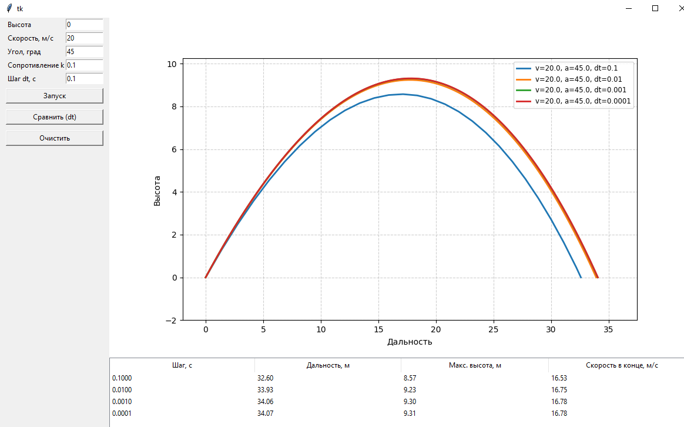
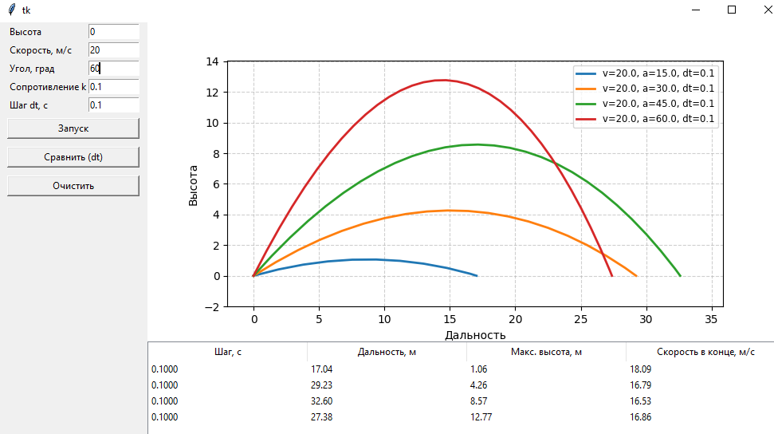

### Моделирование полёта тела в атмосфере

**Задание:**  
Реализовать приложение для моделирования полёта тела в атмосфере.  
Предусмотреть возможность ввода шага моделирования и вывода результатов.

Выполнить моделирование **без очистки предыдущих результатов** для различных шагов моделирования, сравнить траектории и заполнить таблицу:

| Шаг моделирования, с | 1     | 0.1   | 0.01  | 0.001 | 0.0001 |
|----------------------|-------|-------|-------|-------|--------|
| Дальность полёта, м | 17.38 | 32.60 | 33.93 | 34.06 | 34.07  |
| Максимальная высота, м | 2.92  | 8.57  | 9.23  | 9.30  | 9.31   | 
| Скорость в конечной точке, м/с | 13.52 | 16.53 | 16.75 | 16.78 | 16.78  |

**Выводы:**
1. Шаг моделирования влияет на точность расчетов. Уменьшение шага моделирования ведет к увеличению максимальной дальности полета.

2. В зависимости от выбора угла меняется высота, дальность. 
