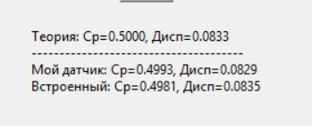
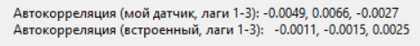

### Базовый  датчик сч

**Задание:**

-реализовать базовый датчик случайных чисел;
-вычислить выборочные среднее и дисперсию:
-для реализованного датчика;
-для встроенного генератора языка программирования;
-размер выборки — 100 000 значений;
-сравнить результаты с теоретическими;
-сделать вывод.


### Реализован линейный конгруентный генератор
```
    def random(self):
        self.state = (self.a * self.state + self.c) % self.m
        return self.state / self.m
```

Параметры
-
```self.state = seed = 42
        self.m = 2 ** 31 - 1  # Модуль, число Мерсена
        self.a = 1103515245  # Множитель Халла-Добелла
        self.c = 12345 #Приращение 0
```

Теория.
БД генерирует числа с промежутка [0,1]
Для него существуют точные формулы

мат ожидание
```
m_custom = statistics.mean(sample_custom)
```
дисперсия
```
v_custom = statistics.variance(sample_custom)
```


- Как можно увидеть, датчики дают результаты близкие к теоретическим

Требования/свойства
равномерное распределение на [0.1]
```
    def random(self):
        self.state = (self.a * self.state + self.c) % self.m
        return self.state / self.m
```
- Сначала согласно формуле сначала получается случайное число,
затем значение возвращается в нужный диапазон

Отсутствие корреляции 
```
def autocorrelation(data, lag):
    n = len(data)
    if lag >= n:
        return 0
    mean = statistics.mean(data)
    numerator = sum((data[i] - mean) * (data[i+lag] - mean) for i in range(n - lag))
    denominator = sum((x - mean) ** 2 for x in data)
    if denominator == 0:
        return 0
    return numerator / denominator
```



- Апериодичность
Формально апериодично, но де факто период = 2 147 483 647
- Воспроизводимость 
Выполняется поскольку одинаковый сид задает одинаковую последовательность
